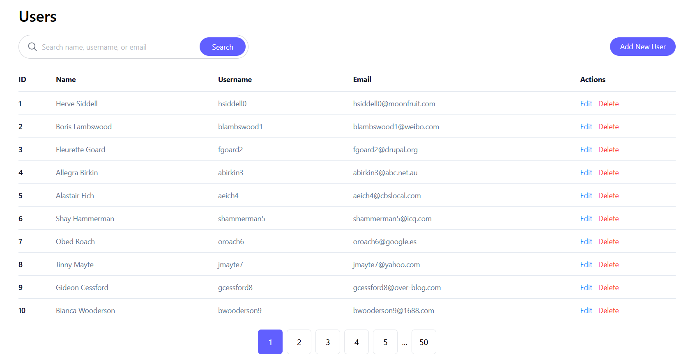
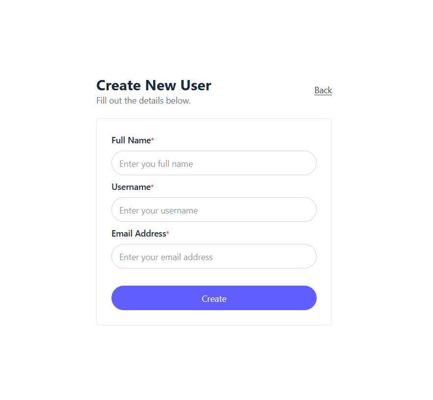
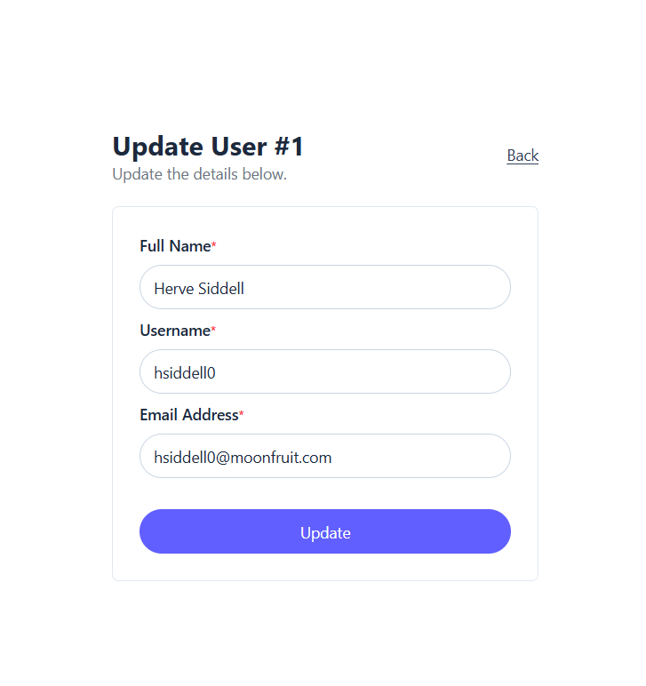

# User Management Application

A full-stack user management application with a React frontend and Express.js backend.

## Tech Stack

### Backend
- Express.js 5
- TypeScript 7
- Node.js 24
- npm 12

### Frontend
- React 19
- Vite 8
- Tailwind CSS 4
- Wouter 3
- React Hook Form 7
- TypeScript 6

## Project Structure

```text
.
├── backend/
└── frontend/
```

## Getting Started

### Prerequisites

Make sure you have the following installed:

- Node.js `24`
- npm `12`

Verify your versions:

```bash
node -v
npm -v
```

### Run the Backend

Open a terminal and navigate to the backend folder:

```bash
cd backend
npm install
npm run dev
```

**Backend URL:** http://localhost:3000

### Run the Frontend

Open another terminal and navigate to the frontend folder:

```bash
cd frontend
npm install
npm run dev
```

**Frontend URL:** http://localhost:5173

> The backend and frontend should be running simultaneously in separate terminal windows.

## URLs

| Service | URL |
|---|---|
| Frontend | http://localhost:5173 |
| Backend | http://localhost:3000 |

> The frontend communicates with the Express.js backend API for user management operations.

## Pages

### Users

**URL:** `/users`

User listing page with search, pagination, and user management actions.



### Create User

**URL:** `/users/create`

Page for creating a new user.



### Edit User

**URL:** `/users/:id/edit`

Page for editing an existing user.



## Page Routes

| Page | URL | Description |
|---|---|---|
| Users | `/users` | View, search, and manage users |
| Create User | `/users/create` | Create a new user |
| Edit User | `/users/:id/edit` | Edit an existing user |